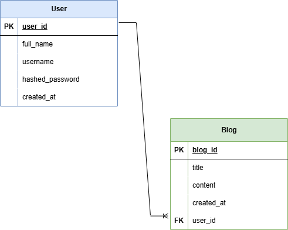

## Personal Blog API 🗒️

A REST API for a personal blogging platform built with FastAPI. This project allows user to register, log in, and manage their blogs securely using JWT authentication. Guests can view all published blogs without authentication.

### ✨ Features
- User registration and login
- JWT Authentication
- Protected Blog routes
- CRUD functionalites for Blog
- Public access for guests

### ⚙️ Tech Stack
- Python
- FastAPI
- SQLAlchemy
- JWT Authentication
- Neon (PostgreSQL)

### 🗄️ Database Design

### 📦 Installation
Clone the repository:

`git clone https://github.com/gautam-32b7/personal-blog.git`

Create virtual environment:

`python -m venv .venv`

Activate virtual environment:

`.venv\Scripts\activate`

Install dependencies:

`pip install -r requirements.txt`

### 🏃‍♂️‍➡️ Run the application
`fastapi dev main.py`

### 🗒️ API Documentation
FastAPI automatically generates API documentation.

- Swagger UI: `/docs`

### 📡 API Endpoints

#### Authentication
| Method | Endpoint | Description     |
|--------|----------|-----------------|
| POST   | /register| Register a user |
| POST   | /login   | Login a user    |

#### Blogs
| Method | Endpoint        | Access    |
|--------|-----------------|-----------|
| GET   | /blogs           | Protected |
| GET   | /blogs/{blog_id} | Protected |
| POST  | /blogs           | Protected |
| PUT   | /blogs/{blog_id} | Protected |
| DELETE| /bllogs/{blog_id}| Protected |

#### Guests
| Method | Endpoint   | Description     |
|--------|------------|-----------------|
| GET    | /          | Get all blogs   |
| GET    | /{blog_id} | Get a blog      |